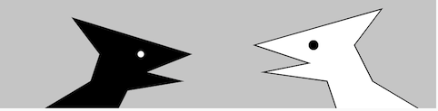

# 1. Introduction
<!-- https://github.com/jht1493/ICM-2020-Code -->
[](https://editor.p5js.org/jht1493/sketches/sxI2SjRrh)
<!-- https://github.com/jht1493/ICM-2020-Code/blob/master/weeks/01_intro.md -->

<!-- 

JHT - Week 1 Worksheet
https://docs.google.com/document/d/1Qu7qf-E6PblFg8U3MvfP_xVeca9yT8Bt6mIsSYAxf0s/edit

https://docs.google.com/spreadsheets/d/1ok96W7jiPLmKrFzXoknoUt6YzPEZbnNLM_W6In7lDBM/edit?resourcekey#gid=942059347
Homework Form (Responses) - ICM CODE JHT

 -->

##  What is computational media?
  * What is programming?
  * How can I apply programming to _____________?
  * As a ____________, why would I want or need to write software?
  * Can programming be an expressive medium?
  * Why are we introducing programming through drawing?
  * [Example projects for Inspiration](https://github.com/ITPNYU/ICM-2021-Code/blob/master/Inspiration.md)

## book - Code as Creative Medium 
 <!--  * [Code as Creative Medium](https://www.amazon.com/gp/product/0262542048) -->
   * [NYU Library Ebook](https://ebookcentral.proquest.com/lib/nyulibrary-ebooks/detail.action?docID=6454626&query=Code+as+Creative+Medium) | [Amazon](https://www.amazon.com/gp/product/0262542048)

## Programming language discussion
  * General discussion of programming languages
  * History of creative coding frameworks
      * [Processing](https://processing.org/) and [p5.js](https://p5js.org/) 
      *  what's [processing.js](http://processingjs.org/)?
      * [History of p5.js video](https://www.youtube.com/watch?v=FdsWWjqoPKU)
      * [openFrameworks](https://openframeworks.cc/), [Cinder](https://libcinder.org/)
      * [Max/MSP](https://cycling74.com/) [dataflow programming](https://en.wikipedia.org/wiki/Dataflow_programming)
      * How does [Arduino](https://www.arduino.cc/) fit in?

<!-- >> is p5js lib for Arduino still in use? https://github.com/sarahgp/p5bots -->

<!-- * [Introduction to Code with p5.js Video](https://youtu.be/yPWkPOfnGsw) -->
<!-- * [p5.js Web Editor Promo Video](https://youtu.be/dtHxDggkBYc) -->

## p5.js in the context of the browser
  * Landscape of HTML, CSS, and JavaScript
  * Other JS frameworks
  * Server-side vs. client-side
  * What is the difference between p5 and JavaScript?

## Participating in an open-source community
  * [What is git and github?](https://thecodingtrain.com/beginners/git-and-github/1-introduction.html)
  * When should you post to a forum vs. file a github issue?
  * Who makes these things?

# Getting started, your first program 

- recommendation: read chapters before watching videos
- play with the sketches discussed in the chapters as you read.

## book - Getting Started with p5.js 
  * Chapter 1-3 of [Getting Started with p5.js book](http://amzn.to/2ckixCW) 
    * [NYU Library Ebook](https://ebookcentral.proquest.com/lib/nyulibrary-ebooks/detail.action?docID=4333728)
    * [git source code](https://github.com/lmccart/gswp5.js-code)
    * [sketches - Chapter 1-3](https://editor.p5js.org/jht1493/collections/l4oMbMJ_u)

## tutorials: Drawing

<!-- Code! Programming with p5.js -->
<!-- https://thecodingtrain.com/beginners/p5js/index.html -->

* Programming for Beginners with p5.js
  * [video 1.1 Introduction](https://thecodingtrain.com/beginners/p5js/1.1-introduction.html) (~13 min)
<!-- * [Introduction to Code with p5.js Video](https://youtu.be/yPWkPOfnGsw) -->

* p5.js Web Editor Tutorial
  * [video 1.2 p5.js Web Editor](https://thecodingtrain.com/beginners/p5js/1.2-p5js-web-editor.html) (~8 min)
<!-- * [p5.js Web Editor Tutorial](https://youtu.be/MXs1cOlidWs) -->

* Shapes & Drawing 
  * [video 1.3 Shapes and Drawing](https://thecodingtrain.com/beginners/p5js/1.3-shapes-and-drawing.html) (~26 min)
  * [sketch - Shapes and Drawing](https://editor.p5js.org/codingtrain/sketches/HJ1WjEPwQ)
<!-- * [Shapes & Drawing video tutorial](https://youtu.be/c3TeLi6Ns1E) -->

* Color 
  * [video 1.4 Color](https://thecodingtrain.com/beginners/p5js/1.4-color.html) (~18 min)
  * [sketch - Color](https://editor.p5js.org/codingtrain/sketches/rJ9MQSwvm)
<!-- * [Color video tutorial](https://youtu.be/riiJTF5-N7c) -->

* Errors and Console
  * [video 1.5 Errors and Console](https://thecodingtrain.com/beginners/p5js/1.5-errors-and-console.html) (~7 min)
<!-- * [Errors and Console Video Tutorial](https://youtu.be/LuGsp5KeJMM) -->

* Code Comments
  * [video 1.6 Code Comments](https://thecodingtrain.com/beginners/p5js/1.6-code-comments.html) (~7 min)
<!-- * [Code Comments Video Tutorial](https://youtu.be/xJcrPJuem5Q) -->

## p5.js references

* [p5.js reference](http://p5js.org/reference)

* [p5js-cheat-sheet](https://bmoren.github.io/p5js-cheat-sheet)

# More

## Additional viewing / reading:
   <!-- * [Code as a Creative Medium] | [NYU Library Ebook](https://ebookcentral.proquest.com/lib/nyulibrary-ebooks/detail.action?docID=6454626&query=Code+as+Creative+Medium) | [Amazon](https://www.amazon.com/gp/product/0262542048) -->
   * [Pick an Eyeo Talk that looks interesting](https://vimeo.com/eyeofestival/)
      * Suggestion: [Eyeo 2019 - Amon Millner](https://vimeo.com/355843375)

### More on p5
* [All introductory p5.js videos](https://thecodingtrain.com/beginners/p5js/)
<!-- (https://www.youtube.com/playlist?list=PLRqwX-V7Uu6Zy51Q-x9tMWIv9cueOFTFA) -->
* Comparing Processing and p5.js
  * [Part 1 video](https://youtu.be/AmlAiKsiy0o) (~17 min)
  * [Part 2 video](https://youtu.be/AsjPJ5AWkDc) (~23 min)
  * [Part 3 video](https://youtu.be/_y8rEHjqzRA) (~10 min)
* [Overview of p5.js Web Editor with Cassie](https://youtu.be/x1rJJRVTpAI) (~23 min)

### More on computational drawing
   * [FORM+CODE: Introduction and What is Code?](http://formandcode.com)
   * [Computational Color](http://printingcode.runemadsen.com/lecture-color/) | [Long version: 4 chapters](https://programmingdesignsystems.com/color/a-short-history-of-color-theory/index.html)
   * [More about shapes (specifically "custom shapes" with vertices and bezier curves)](https://programmingdesignsystems.com/shape/custom-shapes/index.html#custom-shapes-pANLh0l)
   * [p5 playground](http://yining1023.github.io/p5PlayGround/)

### More on the Internets
  <!-- * [The Machine Stops](https://www.cs.ucdavis.edu/~koehl/Teaching/ECS188/PDF_files/Machine_stops.pdf) by E. M. Forster, November 1909 -->
  * [The Machine Stops](https://www.ele.uri.edu/faculty/vetter/Other-stuff/The-Machine-Stops.pdf), by E. M. Forster, November 1909

   * [As We May Think](http://www.theatlantic.com/magazine/archive/1945/07/as-we-may-think/303881/), Vannevar Bush
   * [Long Live the Web](http://jblomo.github.io/webarch253/slides/Long_Live_the_Web.pdf), Tim Berners-Lee

[](https://editor.p5js.org/jht1493/sketches/sxI2SjRrh)

-------------------------------------------------------------------------------
# Your Coding Journey

## Challenges
- learning to think like the computer
  - thinking in numbers
  - understanding flow, order of operations
- making the invisible visible  
  - time
  - state

## Strategies
- buy hard-copy of books. highlight, write margin notes, add bookmarks. make it yours.
- draw pictures of what you've learned
- re-mix and experiment with sketches
- create your own summary sheet of p5js terms as you use them
- if you get stuck, document the issues
  - duplicate your sketch, add issues as comments
  - bring your sketch to class and ask for help

-------------------------------------------------------------------------------
# 1. Recap, Explore and Experiment - Introduction

Let's recap, explore, and experiment with the concepts introduced in this session.

- draw a rough schematic of what you've learned so far about p5js
- after you finish these exercises redraw with any new insights

So far our sketches define functions `setup` and `draw`.
The function `setup` is called once when we hit the play button,
and the function `draw` is called repeatedly until we hit the stop button.
Also we haved used functions defined by the p5js library,
like `ellipse` and `rect`, to draw shapes on the canvas.

In these exercises we'll explore 
- "states" that stick around (fill and stroke)
- how to create buttons to run code   
- how to use console.log to debug your code   
- the behavior of alpha value for colors   
- how to define your own functions   

For these sketches no drawing is done in the function `draw`. Drawing will be triggered by clicking on buttons.
When nothing is drawn the canvas will start out white.

## Ex 1.1 play sketch draw_rect

[sketch - draw_rect](https://editor.p5js.org/jht1493/sketches/WJFtFBmnK) Open this sketch in a separate window so that you can play it and read this page at the same time.

- if your screen is too small to allow viewing the sketch and this page at the same time, print out this page as you explore the sketch.
- buttons will appear below canvas

This sketch defines buttons that can be used to draw on the screen. 
Here's the code that defines one of the buttons and its action:

```
  createButton('backg 240').mousePressed(function() {
    background(240);
  });
```

We'll get into details of how to create your own button later.
For now we'll use buttons to explore p5js drawing behavior.

- play the sketch, click on the buttons in different orders and note behavior

### Questions

- did you notice that sometimes the left rect can be white or gray? 
    - if the answer is not clear bring as question to class

- what are possible ways to represent color for the function `fill`
  - check out the reference for [`fill`](https://p5js.org/reference/#/p5/fill)

### > Try

- try adjusting the colors specified in calls to function `fill`

## Ex 1.1 explore sketch draw_rect_print

In this sketch the function `console.log`
is added so that we can follow the execution of the code called by the buttons in the console.
We are not using the p5js function [print](https://p5js.org/reference/#/p5/print) to avoid some bugs/issues.

[sketch - draw_rect_log](https://editor.p5js.org/jht1493/sketches/NlCr2UD2P) Open this sketch in a separate window so that you can play it and read this page at the same time.

Code that uses the function `console.log` to help debug:
```
  createButton('backg 240').mousePressed(function() {
    console.log('calling background');
    background(240);
  });
```

### > Try

- setting different colors for each shape, eg:
  - `fill(100)`
  - `fill(100,20)`

In p5js a color can be represented in a number of ways.
Here are a few:

- color name, eg: 'white', 'black', 'red', 'green', 'yellow', 'blue'

- gray scale number, eg: 0 (white), 128 (gray), 255 (black)

- red, green, blue, alpha, eg: 255, 0, 0, 100 is full red with medium alpha setting. Alpha is optional.

## Ex 1.1 explore sketch draw_rect_alpha

In this sketch alpha values are used to modify the intensity of colors.

[sketch - draw_rect_alpha](https://editor.p5js.org/jht1493/sketches/6mrwOv4RD) Open this sketch in a separate window so that you can play it and read this page at the same time.

This sketch uses the Red, Green, Blue, Alpha format for colors. 
The values Red, Green, Blue and Alpha are numbers between 0 and 255. 
The alpha value can range from 0 (no alpha, white color), to 255 (full value of the color components). 
For example, alpha value 127 will mix an even amount of the background color with the fill color.
Alpha value 20 will give a very light tint of the fill color on the background.

### > Try

- clicking each button repeatedly and observe the layering of the colors

- low values of alpha eg. 10, and compare to medium alpha value eg. 100

## Ex 1.1 explore sketch draw_rect_createSpan

In this exercise a few other functions are added
to explore the p5js canvas coordinate system, shapes, and color.

[sketch - draw_rect_createSpan](https://editor.p5js.org/jht1493/sketches/C83N_DY9w) Open this sketch in a separate window so that you can play it and read this page at the same time.

### Questions

Move the mouse on the canvas and observe the values displayed below the canvas.

- when do the numbers change and when don't they change?

- what is the lowest value for mouseX within the canvas area?

- what is the largest value for mouseX within the canvas area?

- what value in the code will change the width of the canvas?

- what color values are reported for different areas on the canvas?

## Ex 1.2 explore sketch draw_shapes_body 

[sketch - 1.2 draw_shapes_body](https://editor.p5js.org/jht1493/sketches/X5iRxm8HK) Open this sketch in a separate window so that you can play it and read this page at the same time.

Click on the buttons and observe the actions and the messages that appear in the console.
In the body of the mousePressed function you can call as many other functions as you wish.

- buttons Rect and Circle, note no fill color set

- button Shapes draws 3 shapes:
```
  createButton('Shapes').mousePressed(function() {
    print('drawing shapes');
    // fill(red, green, blue, alpha)
    fill(255, 0, 0, 20); // Red, alpha 20
    rect(0, 100, 200, 200);
    // fill(red, green, blue, alpha)
    fill(255, 255, 0, 20); // Yellow, alpha 20
    circle(200, 200, 200)
    // fill(red, green, blue, alpha)
    fill(0, 255, 0, 20); // Green, alpha 20
    rect(200, 100, 200, 200);
  });
```

## Ex 1.2 explore sketch draw_shapes_func

[sketch - 1.2 draw_shapes_func](https://editor.p5js.org/jht1493/sketches/qEgdTdx0K) Open this sketch in a separate window so that you can play it and read this page at the same time.

Click on the buttons and observe the actions and the messages that appear in the console.

Let's look at the definition of function `draw_shapes`:

```
function draw_shapes() {
  // fill(red, green, blue, alpha)
  fill(255, 0, 0, 20); // Red
  rect(0, 100, 200, 200);
  // fill(red, green, blue, alpha)
  fill(255, 255, 0, 20); // Yellow
  circle(200, 200, 200)
  // fill(red, green, blue, alpha)
  fill(0, 255, 0, 20);  // Green
  rect(200, 100, 200, 200);
}
```

Unlike the functions we've seen so far (eg. `print`, `createButton` etc), 
function `draw_shapes` is not part of p5js library.
function `draw_shapes` and it's definition is written for this exercise.
The name is choosen to be descriptive of what the function supposed to do.
You are encouraged to write functions to break up your code into meaningful units.
I prefer to use the underscore characters in names 
I create to distinguish them from built-in p5js/javascript names.

In this sketch function `draw_shapes` is called from 
the button 'Shapes' defined in the function setup:

```
function setup() {
  ...
  createButton('Shapes').mousePressed(function() {
    print('calling draw_shapes');
    draw_shapes();
  });
  ...
}
```

- You choose the name for your functions to describe the intent of the code
- A function name must begin with a letter (upper or lower case), 
followed by any number of letters, numbers or underscore characters.

### Questions

- what happens if you repeatedly click on button Shapes? why?

- what happens if you click on buttons Rect or Circle after button Shapes? why?

## Ex 1.2 explore sketch draw_shapes_ui

[sketch - 1.2 draw_shapes_ui](https://editor.p5js.org/jht1493/sketches/DGQoBYV9x)
 Open this sketch in a separate window so that you can play it and read this page at the same time.

About this sketch:
- added function create_ui and function update_ui 
- code is re-used from previous sketch to display mouse location and canvas color

### > Try

- add or change shapes drawn in function draw_shapes

- add other buttons to draw other shapes

## What have you learned?

- draw your own schematic of p5js - illustrate what you've learned so far
- [example p5js schematic](../assets/p5js-schematic.jpg)

-------------------------------------------------------------------------------
## What's next?

- wouldn't it be cool if we could animate our drawing?
- or create patterns with our shapes? 
- next up animation and variables!

-------------------------------------------------------------------------------
## DOM functions `createButton`, `createSpan`, `select`

- curious about functions `createButton`, `createSpan`, `select`? (if not, ok to skip this section)
- these are DOM functions
- DOM means Document Object Model - how the browser refers to visual elements on the page
- functions `createButton`, `createSpan`, and `select` manage DOM elements
- function `createButton` creates a button element on the page
- function `createSpan` creates a container for text, spans are layed out on a line
- function `select` is used to referred to an element by it's id
- elements may be assigned an id which is later used to reference them
- an id is descriptive text you make up

- the canvas itself is DOM element!

- in future sessions we'll see how to adjust layout of DOM elements

### to make a button
- copy paste code for `createButton`
- change button title and body

```
function setup() {
  createCanvas(400, 300);
  // createButton('title-for-button-')...
  createButton('backg 240').mousePressed(function() {
    // Code to run when button pressed, the "body"
    background(240);
  }); // End of createButton
...
```

### to display a value
- copy paste code for `createSpan` and `select`
- replace parameter to `id`, `select` and `html`

```
  // setup code
  // first parameter 'imouseX' is id for span
  // replace with your string
  createSpan().id('imouseX');

  // draw code
  // replace string imouseX with your id
  // parameter '#imouseX' is id for span. character # is required
  select('#imouseX').html('[mouseX='+mouseX+'] ')
```

-------------------------------------------------------------------------------
## Getting Started with p5.js book sketches

Sketches from the [Getting Started book](http://amzn.to/2ckixCW).  
You are invited to remix and combine them to further explore.  

add color  
change shapes  
have fun ...

- Chapter 2 Starting to Code

[Ex_02_01 Draw an Ellipse](https://editor.p5js.org/jht1493/sketches/1jYHAXZRF)  
[Ex_02_02 Make Circles](https://editor.p5js.org/jht1493/sketches/Cc8MICNun)  

- Chapter 3 Draw

[Ex_03_04 quad tri](https://editor.p5js.org/jht1493/sketches/4ru5A30iE)	  
[Ex_03_06 circles touch](https://editor.p5js.org/jht1493/sketches/R0o3EvVOC)  
[Ex_03_09 arcs](https://editor.p5js.org/jht1493/sketches/lj5UimD1G)  
[Ex_03_17 alpha circles](https://editor.p5js.org/jht1493/sketches/sxI2SjRrh)  
[Ex_03_19 beginShape](https://editor.p5js.org/jht1493/sketches/xFElx4UBj)  
[Ex_03_20 Two Creatures](https://editor.p5js.org/jht1493/sketches/mPX1b9278)  
[Ex_03_99 Robot 1: Draw](https://editor.p5js.org/jht1493/sketches/0EzMYSpky)  

[sketch - Ex_03_20 Two Creatures ui](https://editor.p5js.org/jht1493/sketches/MLzEHAnCh) -remix-

[](https://editor.p5js.org/jht1493/sketches/mPX1b9278)

