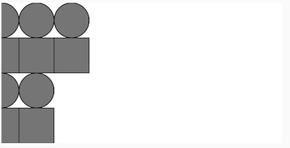
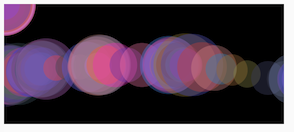

# 2. Animation: Variables

<!-- 
https://docs.google.com/document/d/1X-fESCgnicsf-yjSSP2raQDuvTCfFrNOFVMloGXO2OA/edit#
ICM Code Worksheet — Week 2 (JHT
 -->
 
<!-- 
Animation: Variables ->
Variables 
Loops -- for patterns
!!@ Go all the way on variable
make Chapter 6 Transforms & 8 Motion optional
!!@ Consider addling createGraphics for layered drawing
-->

[ ](https://editor.p5js.org/jht1493/sketches/W_nCg2LI2)

<!-- *The videos in this section were created ~2 years ago. They use different editors for p5.js. All of the concepts should still apply, however, there are some minor changes. Most notably in JavaScript `let` is now the preferred way to declare a variable over `var`. If you would like to learn more about this you can [watch this video about let vs var](https://youtu.be/q8SHaDQdul0).* -->
<!-- 
!!@ Replace this warning with tips for updating old js to latest conventions
>> var -> let
>> print -> console.log
>> offline editor vs. https://editor.p5js.org/
 -->

 ## book - Getting Started with p5.js 
  * Chapter 4 Variables through Ex. 4.5
    * [sketches](https://editor.p5js.org/jht1493/collections/yH3IYcxzz)
  * Chapter 8 Motion through Ex. 8.9
    * [sketches](https://editor.p5js.org/jht1493/collections/a0FX7oZfY)
  * Going further: Chapter 6 Transformations
    * [sketches](https://editor.p5js.org/jht1493/collections/LyMXjpqPV)
  * Going further: Chapter 8 Motion 8.10-8.15 (More complex motion)
    * [sketches](https://editor.p5js.org/jht1493/collections/a0FX7oZfY)
  * [Getting Started with p5.js book](http://amzn.to/2ckixCW) 
    * [Ebook (free with NYU Library login)](https://ebookcentral.proquest.com/lib/nyulibrary-ebooks/detail.action?docID=4333728) 
    * [git source code](https://github.com/lmccart/gswp5.js-code)
    * recommendation: read chapters before watching videos. play with the sketches discussed in the chapters as you read.

## tutorials: Basics

* `setup()`, `draw()`, and other events: `mousePressed()`, etc.

* Built-in variables
  * [video 2.1: Variables in p5.js (mouseX, mouseY)](https://thecodingtrain.com/tracks/code-programming-with-p5-js/code/2-variables/1-mouseX-mouseY) (~11 min)
  * [sketch](https://editor.p5js.org/codingtrain/sketches/IeblvUQrf)
* User defined variables
  * [video 2.2: Variables in p5.js (Make your own)](https://thecodingtrain.com/tracks/code-programming-with-p5-js/code/2-variables/2-define-variables) (~11 min)
  * [sketch - make your own variable](https://editor.p5js.org/codingtrain/sketches/xPXNdPy17)
  * [sketch - growing circle](https://editor.p5js.org/codingtrain/sketches/ehbMJ-otC)

* Incrementing variables
  * [video 2.3: Incrementation Operations ](https://thecodingtrain.com/tracks/code-programming-with-p5-js/code/2-variables/3-incrementation) (~5 min)

* The [random()](http://p5js.org/reference/#/p5/random) function
  * [video 2.4: random()](https://thecodingtrain.com/tracks/code-programming-with-p5-js/code/2-variables/4-random) (~11 min)
  * [sketch - Random Square Design](https://editor.p5js.org/codingtrain/sketches/Sl8ml_Lz8)
  * [sketch - Random House Exercise](https://editor.p5js.org/codingtrain/sketches/HGq_S0Z5H)
  * [sketch - Random Points](https://editor.p5js.org/codingtrain/sketches/h7hFqoV6H)
  * [sketch - Painting Exercise 1](https://editor.p5js.org/codingtrain/sketches/stERy5a1D)
  * [sketch - Painting Exercise 2](https://editor.p5js.org/codingtrain/sketches/IyyJ1QYKh)

  <!-- * [Rainbow Paintbrush in p5.js](https://medium.com/@kellylougheed/rainbow-paintbrush-in-p5-js-e452d5540b25) by Kelly Lougheed -->

* The [map()](http://p5js.org/reference/#/p5/map) function
  * [video 2.5: map()](https://thecodingtrain.com/tracks/code-programming-with-p5-js/code/2-variables/5-map) (~11 min)
  * [sketch](https://editor.p5js.org/codingtrain/sketches/yJqbGf71)
  * [sketch - 2.5 map function ui](https://editor.p5js.org/jht1493/sketches/OGwu_nlNh)

<!-- * [video 2.1: Variables in p5.js (mouseX, mouseY)](https://www.youtube.com/watch?v=RnS0YNuLfQQ&list=PLRqwX-V7Uu6Zy51Q-x9tMWIv9cueOFTFA&index=5) -->
<!-- * [video 2.2: Variables in p5.js (Make your own)](https://www.youtube.com/watch?v=Bn_B3T_Vbxs&list=PLRqwX-V7Uu6Zy51Q-x9tMWIv9cueOFTFA&index=6) -->
<!-- * [video 2.5: random()](https://www.youtube.com/watch?v=nfmV2kuQKwA&list=PLRqwX-V7Uu6Zy51Q-x9tMWIv9cueOFTFA&index=9) -->
<!-- * [video 2.4: map()](https://www.youtube.com/watch?v=nicMAoW6u1g&list=PLRqwX-V7Uu6Zy51Q-x9tMWIv9cueOFTFA&index=8) -->


## tutorials: Transformations

  * [video 9.1: translate](https://youtu.be/o9sgjuh-CBM) (~ 22min)

  * [video 9.2: scale](https://youtu.be/pkHZTWOoTLM) (~ 9 min)

  * [video 9.3: More on transformations](https://youtu.be/IVMvq9rd8dA) (~ 9 min)

  <!-- * [video 9.1: `translate()`, `rotate()`, `push()`, `pop()`](https://youtu.be/o9sgjuh-CBM)
  * [video 9.2: `scale()`](https://youtu.be/pkHZTWOoTLM)
  * [video 9.3: More on transformations](https://youtu.be/IVMvq9rd8dA) -->


## More code examples

  * [sketch - random painting](https://editor.p5js.org/icm/sketches/HJg8jfcT3)
  * [sketch - mouse controlled painting](https://editor.p5js.org/icm/sketches/r1JeQqa3)
  * [sketch - moving circle](https://editor.p5js.org/icm/sketches/Bymv7ca2)

## Going Further

  * Clock example  
    - [sketch - clock](https://editor.p5js.org/icm/sketches/ryYueiWu7)
    - [video : Clock coding challenge ](https://youtu.be/E4RyStef-gY) (~21 min)
  * Tutorial article: [Recode Catalog by John Whitney](https://github.com/itpresidents/icm-help-sessions-2020/blob/master/session-02/session-02.md)

   * [Rainbow Paintbrush in p5.js](https://medium.com/@kellylougheed/rainbow-paintbrush-in-p5-js-e452d5540b25) by Kelly Lougheed

[ ](https://editor.p5js.org/jht1493/sketches/wJCzyVzBm)

-------------------------------------------------------------------------------
# 2. Recap, Explore and Experiment - Animation: Variables

Let's recap, explore, and experiment with the concepts introduced in this session.

-------------------------------------------------------------------------------
## 2.0 Increment by one

Ways to add one to a variable `x`:
* `x = x + 1;` 
* `x += 1;` 
* `x++;`

-------------------------------------------------------------------------------
## Ex 2.1 mouseX and mouseY

[sketch - p5js Code! - 2.1 - mouseX,mouseY](https://editor.p5js.org/codingtrain/sketches/IeblvUQrf) Open these sketch in a separate window so that you can play it and read this page at the same time.

This sketch from the video uses the p5js variables `mouseX` and  `mouseY` to draw circles on the canvas. Code in the function `mousePressed` causes the canvas to be black whenever mouse is pressed anywhere on the page. A circle is drawn when the mouse moves over the canvas.

```
function draw() {
  noStroke();
  fill(255, 50);
  circle(mouseX, mouseY, 24);
}

function mousePressed() {
  background(0);
}
```

Let's re-mix this sketch and spice it up a little using basic arithmatic.

### mouseDragged

[sketch - 2.1.2 mouseX,mouseY](https://editor.p5js.org/jht1493/sketches/KaijsTyVc)

To have drawing happen only when the mouse button is pressed and moved, we define [function mouseDragged](https://p5js.org/reference/#/p5/mouseDragged).

```
function mouseDragged() {
  circle(mouseX, mouseY, 24);
}
```

### arithmetic on mouseX

[sketch - 2.1.2 mouseX,mouseY arith](https://editor.p5js.org/jht1493/sketches/pmA0d9Uqt) Two circles are drawn when the mouse moves in this sketch.

We can draw multiple shapes based on the mouse location using some basic arithmetic. 

```
function mouseDragged() {
  circle(mouseX-25, mouseY, 24);
  circle(mouseX+25, mouseY, 24);
}
```

### > Try

- adding other shapes to draw when the mouse is dragged.

### > Try

- as one shape is drawn, another shape is drawn to mirror it

[sketch - 2.1.2 mouseX mirror](https://editor.p5js.org/jht1493/sketches/C2bgbELqa)

### > Try

- Add ui elements to control color and give feedback about mouse location and canvas color. Borrow code from previous session.

[sketch - 2.1.4 mouseX mirror ui](https://editor.p5js.org/jht1493/sketches/I8zejgYIX)

-------------------------------------------------------------------------------
## Ex 2.2 Variables circleX

[sketch - make your own variable](https://editor.p5js.org/codingtrain/sketches/xPXNdPy17)  

In this sketch the variable circleX is used to control the location of the circle. The circle will move to the right indefinitely. We'll use the math operator remainder to have the circle jump back to the left after it has passed the right edge of the canvas.

The remainder operator will give the remainder when a number (x) is divided by another (n).
The net effect is that one value can be use to limit another value.
Some examples:
```
1 % 3 // result is 1, 1 divided by 3 is 0, remainder 1
4 % 3 // result is 1, 4 divided by 3 is 1, remainder 1
5 % 3 // result is 2, 5 divided by 3 is 1, remainder 2
x % n // result is always between 0 and n-1
```

[sketch - 2.2.1 circleX width](https://editor.p5js.org/jht1493/sketches/CwYDz_4N2)   

- variable circleX is incremented and limited to the range 0 ... width
- when the value circleX + 1 equals width the result will be clipped to 0

```
  circleX = (circleX + 1) % width;
```

### > Try

- add another shape that moves top to bottom

[sketch - 2.2.1 shape1 shape2 ](https://editor.p5js.org/jht1493/sketches/cuaGTyRYU)   

### > Try

- re-mix [sketch - growing circle](https://editor.p5js.org/codingtrain/sketches/ehbMJ-otC) use the remainder operator to limit the circle growth

[sketch - 2.2.3 circleR growing](https://editor.p5js.org/jht1493/sketches/2ZGRl9x1p)  

### > Try

- remix [sketch - 2.2.1 variable...](https://editor.p5js.org/jht1493/sketches/CwYDz_4N2) with buttons to change the diameter of the circle

[sketch -  2.2.4 circleX width ui](https://editor.p5js.org/jht1493/sketches/UhNMB6GQO)   

### > Try

- disable background drawing and play with alpha colors

- add buttons to change colors

- add button for random color

[sketch - sketch - 2.2.5 variable circleX rgb](https://editor.p5js.org/jht1493/sketches/mDleb9mKk)   

## Ex 2.3 Incrementing for animation

These examples use this coding pattern to create animation: A variable, circleX, is updated by incrementing its value. There is an illusion of motion as the shape is drawn one pixel to the right each time the function 'draw' is called.

```
  circleX = (circleX + 1) % width;
```

We could increase the apparent speed of this animation by adding a value greater than 1:

```
  circleX = (circleX + 2) % width;
```

By increasing the value of the increment, the speed of the shape across the canvas increases.

### > Try

- create a new variable that controls the speed of the animation

[sketch - 2.3.1 shape1 speed](https://editor.p5js.org/jht1493/sketches/WL3YIp05x)

- create a second shape that animates across the screen at a different speed

[sketch - 2.3.2 shape1 shape2 speed](https://editor.p5js.org/jht1493/sketches/IuKS1TIjB)

-------------------------------------------------------------------------------
## Ex 2.4 [function random()](http://p5js.org/reference/#/p5/random)

The random function is a versatile function that can add variety to our sketches.
We've seen it used to produce a random number with in a range:
```
// x will be a random number between width/2 and width
// ie. the right half of the canvas
let x = random(width/2,width);
```
We can also get a less random selection by using an `array` of values. An array is a series of values enclosed in square brackets. In future session we'll get deeper into creating and modifing arrays. For now we'll use them as a source for values.

```
// x will be one of 10,20,100,200
let x = random([10,20,100,200]);
// col will be one of 'red', 'green' or 'yellow'
let col = random(['red','green','yellow']);
```

The array notation can also be used to specify colors with alpha values:
```
let cRed = [255,0,0,10]; // red,green,blue,alpha
let cGreen = [0,255,0,10];
let cYellow = [255,255,0,10];
// pick a random color value
let col = random([cRed,cGreen,cYellow]);
```

### > Try

- remix one of the circleX sketches to change the shape to a random color when the canvas is clicked.

[sketch - 2.4.1 random shape1](https://editor.p5js.org/jht1493/sketches/N2VJYjIWg)

### > Try

- use alpha color and remove `background` function call from `draw` function so drawings build up.

[sketch - 2.4.2 shape1 alpha](https://editor.p5js.org/jht1493/sketches/UDMyivHEQ)

### > Try

- use the frameRate function to slow down the animation
- add variables to quickly experiment with alpha, change in shape1x variable, and size of circle.

[sketch - 2.4.3 shape1 alpha slow](https://editor.p5js.org/jht1493/sketches/iNY8JDhzH)

-------------------------------------------------------------------------------
## Ex 2.5 patterns

[sketch - 2.5 setup pattern draw_shape1](https://editor.p5js.org/jht1493/sketches/OtE1lw_X2)

Open the sketch, make sure the console panel below the sketch is visible,
and play the sketch. You'll see a pattern of gray circles and squares.
The `draw` function is not used. All drawing is done in the `setup` function so only static or non-animated pattern is created.

The canvas should look like this:  


and you should see the console messages. If you don't see all of these lines, pull the top edge of the console panel up to make it bigger.
```
row 1 
draw_shape1 x=0 y=0 
draw_shape1 x=50 y=0 
draw_shape1 x=100 y=0 
row 2 
draw_shape1 x=0 y=100 
draw_shape1 x=50 y=100 
setup done 
```

What's going on?
In this sketch the function `draw_shape1` draws a a circle atop a square. It is called several times from the `setup` function.

### function `draw_shape1`

The function `draw_shape1` is defined in this sketch. It draws a circle and a rect. The location of the drawing will be relative to the position given to the function. By defining our own function we can easily run (or call) a series of instructions. In this case we only do two simple drawings as an illustration. To make a different static pattern, add or modify the function calls `circle` or  `rect`.

```
// Draw a circle on top of square
function draw_shape1(x, y) {
  console.log('draw_shape1 x=' + x + ' y=' + y)
  circle(x + 0, y + 25, 50)
  rect(x - 25, y + 50, 50, 50);
}
```
### parameter variables
The terms `x` and `y` are called `parameter variables` and they will take on values when the function `draw_shape1` is called. The `console.log` line displays the values of `x` and `y` to help us follow the execution of this code.

The function `draw_shape1` is called several times in the `setup` function:
```
  draw_shape1(0, 0);
  draw_shape1(50, 0);
  ...
```
Each time `draw_shape1` is called it will have new values for `x` and `y.`
In the first call both `x` and `y` will be 0, in the second call `x` will be 50 and `y` will be 0.
In effect the `parameter variables x and y` are place holders for values that will be supplied later.

### > Try

- adding `draw_shape1` calls to fill the canvas with the shape.

- modifying the shapes drawn to get a new pattern.

## Saving the canvas

  - When you are experimenting and discover that you have created an interesting pattern it would be nice to easily save it.
Here's an example of a button to save your canvas as a png file.

[sketch - 2.5 setup pattern draw_shape1 save](https://editor.p5js.org/jht1493/sketches/D34BIqcoE)

### > Try

  - add the save button to one of your animated sketches and save a special moment.

-------------------------------------------------------------------------------
## Ex 2.6 rotate

These sketches help visualize the behavior of the `rotate` function.

- As the mouse is moved horizontally the line is rotated. Extra lines are drawn to show the X-Y axis.

[sketch - 2.6.1 rotate mouseX](https://editor.p5js.org/jht1493/sketches/5f-4Wm_1H)  

- A variable is used for the angle. Try different values for the angle.

[sketch - 2.6.2 rotate a_angle](https://editor.p5js.org/jht1493/sketches/mq4r5u0v3)  

- UI elements are added to display the value used for the angle.

[sketch - 2.6.3 rotate ui](https://editor.p5js.org/jht1493/sketches/iYtC2NDy7)  
[sketch - 2.6.4 rotate mouseDragged ui](https://editor.p5js.org/jht1493/sketches/5ZIAjsbyB)  
[sketch - 2.6.5 rotate mouseDragged ui map](https://editor.p5js.org/jht1493/sketches/8ui42o3PL)  

### > Try

- Creating your own sketches to expore the behavior of other drawing functions

<!-- -------------------------------------------------------------------------------
## 2.6 animated patterns 
[sketch - 2.5.1 draw_shape1](https://editor.p5js.org/jht1493/sketches/hgFw3__cZ)
>> parameter variables  
>> speed var  
>> push, translate, pop  

[sketch - 2.5.2 draw_shape1 pattern](https://editor.p5js.org/jht1493/sketches/5JqwobAgJ)
>> creating one line pattern with draw_shape1

[sketch - 2.5.3 draw_shape1 pattern2](https://editor.p5js.org/jht1493/sketches/huhUWN6Uc)
>> creating two line pattern with draw_shape1

### > Try
Add buttons to
- clear background
- change spacing of shapes

[sketch - 2.5.4 draw_shape1 pattern2 ui](https://editor.p5js.org/jht1493/sketches/jiS58glnK)
 -->

<!-- 
# 03_loops
>> !!@ Consider:
>> for-loops should follow  variables, before interaction with if-statements
-->

-------------------------------------------------------------------------------
## Getting Started with p5.js book sketches

Sketches from the [Getting Started book](http://amzn.to/2ckixCW).  
You are invited to remix and combine them to further explore drawings in motion.

  * Chapter 4 through Ex. 4.5

[Ex_04_01 Reuse the Same Values](https://editor.p5js.org/jht1493/sketches/jcN0Maxum)  
[Ex_04_02 Change Values](https://editor.p5js.org/jht1493/sketches/Y2Qra2W_N)  
[Ex_04_03 Adjust the Canvas](https://editor.p5js.org/jht1493/sketches/T4ufWkYjs)  
[Ex_04_04 Basic Arithmetic](https://editor.p5js.org/jht1493/sketches/Eg01Z5WpY)  
[Ex_04_05 Do the Same](https://editor.p5js.org/jht1493/sketches/nUqcuwlY9)   
[Ex_04 Robot 2: Variables](https://editor.p5js.org/jht1493/sketches/mJ_X4q47O)  
[Ex_04 Robot 2: Variable func](https://editor.p5js.org/jht1493/sketches/cyyCJGXOz) -remix-    
[Ex_04 Robot 2: func jiggle](https://editor.p5js.org/jht1493/sketches/D3QUVpQhx) -remix-  

  * Chapter 8 through Ex. 8.9

[Ex_08_03 Move a Shape](https://editor.p5js.org/jht1493/sketches/DJ99paBR7)	  
[Ex_08_04 Wrap Around](https://editor.p5js.org/jht1493/sketches/W_nCg2LI2)   
[Ex_08_05 Bounce Off the Wall](https://editor.p5js.org/jht1493/sketches/wJCzyVzBm)  
[Ex_08_06 Tween](https://editor.p5js.org/jht1493/sketches/vJUCok9aU)   
[Ex_08_06 Tween mouse](https://editor.p5js.org/jht1493/sketches/W11fu5LhG) -remix-  
[Ex_08_08 Draw Randomly](https://editor.p5js.org/jht1493/sketches/SmFX6Ioj_)   
[Ex_08_09 Move Shapes Randomly](https://editor.p5js.org/jht1493/sketches/YjFnLREL7)	

### Going futher

  * Going further: Chapter 6 (Transformations) 

[Ex_06_01 Translating Location](https://editor.p5js.org/jht1493/sketches/P2GfFz2Jv)   
[Ex_06_02 Multiple Translations](https://editor.p5js.org/jht1493/sketches/aNTyhkTAp)   
[Ex_06_03 Corner Rotation](https://editor.p5js.org/jht1493/sketches/7tw-3XmNx)   
[Ex_06_04 Center Rotation](https://editor.p5js.org/jht1493/sketches/-K5nIPw-O)   
[Ex_06_05 Translation Rotation](https://editor.p5js.org/jht1493/sketches/dIUreb8Fc)   
[Ex_06_06 Rotation Translation](https://editor.p5js.org/jht1493/sketches/f61txC7KZ)   
[Ex_06_07 Articulating Arm](https://editor.p5js.org/jht1493/sketches/NqUbfaE2H)   
[Ex_06_08 Scaling](https://editor.p5js.org/jht1493/sketches/TSDh4otF5)   
[Ex_06_09 Strokes Consistent](https://editor.p5js.org/jht1493/sketches/Iy6KGB3Wf)   
[Ex_06_10 Isolating Transformations](https://editor.p5js.org/jht1493/sketches/6vFu9X3jD)   
[Ex_06_99 Robot 4: Translate](https://editor.p5js.org/jht1493/sketches/yGDQyWCf7)   
[Ex_06_99 Robot 4: Translate func](https://editor.p5js.org/jht1493/sketches/7TS45L2cA) -remix-  

  * Going further: Chapter 8.10-8.15 (More complex motion)

[Ex_08_10 Time Passes](https://editor.p5js.org/jht1493/sketches/BoVBnl443)   
[Ex_08_11 Triggering Timed](https://editor.p5js.org/jht1493/sketches/xADLvN6tz)   
[Ex_08_12 Sine Wave Values](https://editor.p5js.org/jht1493/sketches/B4P8dpKW5)   
[Ex_08_13 Sine Wave](https://editor.p5js.org/jht1493/sketches/U80HMnJYf)   
[Ex_08_14 Circular Motion](https://editor.p5js.org/jht1493/sketches/0IZtaK_fH)   
[Ex_08_15 Spirals](https://editor.p5js.org/jht1493/sketches/nAiwy2Qte)   
[Ex_08_99 Robot06_Motion](https://editor.p5js.org/jht1493/sketches/GD_kzWHeR)   

[  ](https://editor.p5js.org/jht1493/sketches/OLzJZWjV5)
