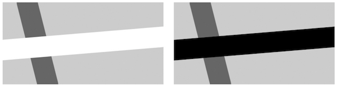
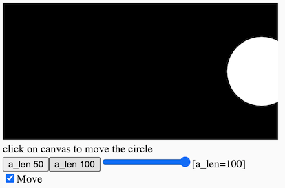

# 3. Interaction: Conditionals

[](https://editor.p5js.org/jht1493/sketches/hV0JF0uwo)

<!-- 
Interaction: Conditionals -> Conditionals 
!!@ Drop ## GUI Interfaces
!!@ Add ## 10PRINT from 04_loops
-->

<!-- 
https://docs.google.com/document/d/14iC_LoImN-RUQumYrOLWjEk24q-KXBzEh0cJoN3Dy3I/edit
JHT Week 3 Worksheet
 -->

<!-- *The videos in this section were created ~2 years ago. They use different editors for p5.js. All of the concepts should still apply, however, there are some minor changes. Most notably in JavaScript `let` is now the preferred way to declare a variable over `var`. If you would like to learn more about this you can [watch this video about let vs var](https://youtu.be/q8SHaDQdul0).* -->

<!-- >> ?? move this comment to video page -->
<!-- >> ?? recommend reading before watching videos -->
<!-- >> guided copy-and-paster: re-mix is ok, start with best practices -->


## book - Getting Started with p5.js 
* Chapter 5. Response
  * [sketches](https://editor.p5js.org/jht1493/collections/u8b97q_m7)
* [Getting Started with p5.js book](http://amzn.to/2ckixCW) 
  * [Ebook (free with NYU Library login)](https://ebookcentral.proquest.com/lib/nyulibrary-ebooks/detail.action?docID=4333728) 
  * [git source code](https://github.com/lmccart/gswp5.js-code)

## tutorials: Conditional Statements

* [video 3.1: Introduction to Conditional Statements ](https://thecodingtrain.com/beginners/p5js/3.1-conditional-statements.html) (~12 min)
  * `if` statement
  * relational operators (`>`, `<`, `<=`, `>=`, `==`, `===`, `!==`)
  * [sketch - if mouseX](https://editor.p5js.org/codingtrain/sketches/z_yjYIha)
* [video 3.2: Bouncing Ball](https://thecodingtrain.com/beginners/p5js/3.2-bouncing-ball.html) (~8 min)
  * [sketch - bouncing ball x](https://editor.p5js.org/codingtrain/sketches/Xm4cmQvU) <!-- >> does not bounce!! -->
  * [sketch - bouncing ball xy](https://editor.p5js.org/icm/sketches/BJKWv5Tn)
  <!-- >> bounces x and y -->
  <!-- >> simpler example that does with going off on left -->
  <!-- println -> console.log -->
* [video 3.3: else, else if, and, or](https://thecodingtrain.com/beginners/p5js/3.3-else-elseif-and-or.html) (~17 min)
  * [sketch - if mouseX](https://editor.p5js.org/codingtrain/sketches/In-bIB8w) <!-- * [sketch - if mouseX AND](https://editor.p5js.org/jht1493/sketches/pK7xE8hN3) -->
  * [sketch - else if](https://editor.p5js.org/jht1493/sketches/VmJD4ZUMJ)
  * [sketch - bounce ball x OR](https://editor.p5js.org/jht1493/sketches/G1WHVQsRV)
  * [sketch - bounce ball x OR ui](https://editor.p5js.org/jht1493/sketches/h0ZJWwOzb)
  <!-- code commented out in sketch -->
  <!-- mentions updating bounceing ball and other sketch -->
  <!-- else if not essential -->
  <!-- >> ?? add better example -->
  <!-- otherwise -->
* [video 3.4: Boolean variables](https://thecodingtrain.com/beginners/p5js/3.4-boolean-variables.html) (~20 min)
  <!-- * [sketch - Boolean variables](https://editor.p5js.org/codingtrain/sketches/yzBpV0CI) !!@ Does not match video -->
  * [sketch - Boolean variables](https://editor.p5js.org/jht1493/sketches/1IcyZZamQ)
  <!-- sketch correct to match video -->
  <!-- >> ?? no Boolean variables used in sketch -->
  <!-- mouseIsPressed variable
  // change state of program
  // toggle boolean value
  on = !on; -->

<!-- 3.1: Introduction to Conditional Statements - video tutorial -->
<!-- https://www.youtube.com/watch?v=1Osb_iGDdjk&list=PLRqwX-V7Uu6Zy51Q-x9tMWIv9cueOFTFA&index=10 -->
<!-- 3.2: Bouncing Ball - video tutorial -->
<!-- https://www.youtube.com/watch?v=LO3Awjn_gyU&list=PLRqwX-V7Uu6Zy51Q-x9tMWIv9cueOFTFA&index=11 -->
<!-- 3.3: `else`, `else if`, AND (`&&`), OR (`||`) - video tutorial -->
<!-- https://www.youtube.com/watch?v=r2S7j54I68c&list=PLRqwX-V7Uu6Zy51Q-x9tMWIv9cueOFTFA&index=12 -->
<!-- 3.4: Boolean variables - video tutorial -->
<!-- https://www.youtube.com/watch?v=Rk-_syQluvc&list=PLRqwX-V7Uu6Zy51Q-x9tMWIv9cueOFTFA&index=13 -->

## GUI Interfaces
One way to practice working with conditionals is to try to code common interface elements in the canvas: e.g. rollover, button, slider, etc. 
<!-- In [week 6](https://github.com/ITPNYU/ICM-2018/blob/master/weeks/06_dom.md) we'll compare this technique to using elements the browser provides for free. -->
- [sketch - circle rollover](https://editor.p5js.org/icm/sketches/H1kCSqah)
- [sketch - square rollover](https://editor.p5js.org/icm/sketches/rkLfL56h)
- [sketch - button hold down](https://editor.p5js.org/icm/sketches/S16-H9pn)
- [sketch - button switch](https://editor.p5js.org/icm/sketches/Sywrrqa2)
- [sketch - quadrant rollover](https://editor.p5js.org/icm/sketches/Hki1I5ah)
- [sketch - rollover with fade](https://editor.p5js.org/icm/sketches/SkPsHcph)
- [sketch - draggable](https://editor.p5js.org/icm/sketches/B13wH5T3)
- [sketch - knob](https://editor.p5js.org/icm/sketches/HkfFHcp2)
- [sketch - slider](https://editor.p5js.org/icm/sketches/H1LXU9ah)

<!-- >> some not easy to reuse this code. !!@ Drop ?? -->
<!-- better to show if and variables used with DOM -->

[](https://editor.p5js.org/jht1493/sketches/hV0JF0uwo)

-------------------------------------------------------------------------------
# 3. Recap, Explore and Experiment - Interaction: Conditionals

Let's recap, explore, and experiment with the concepts introduced in this session.

## Ex 3.1 Variable circleX

Recall from the last session we used a variable `circleX` to animate a circle moving across the screen. When the circle reaches the right edge of the canvas it disappears.

```
  circle(circleX, 150, 64);
  circleX = circleX + 1;
```

[sketch - make your own variable](https://editor.p5js.org/codingtrain/sketches/xPXNdPy17)  

To have the animation wrap around when the circle passes the right edge of the screen, we used the remainder arithmetic operator %.

```
  circleX = (circleX + 1) % width;
```

[sketch - 2.2.1 circleX width](https://editor.p5js.org/jht1493/sketches/CwYDz_4N2)   

In this sketch we replace the remainder arithmetic operator with an `if` statement to get the same effect.

```
  circleX = circleX + 1;
  if (circleX > width) {
    circleX = 0;
  }
```

When the variable `circleX` reaches a value greater than `width` it is set to zero.

[sketch - 3.1.1 variable circleX width if](https://editor.p5js.org/jht1493/sketches/NO5mWO62W)

Let's take a closer look at the `if` statement. It has two main parts, the **test** and the **statements**. 
```
  if (**test**) {
    **statements**
  }
```
The **statements** is any number of statements that will be executed if the **test** is `true`.
Let's take a deeper look at what **tests** are possible.
The syntax of the comparision is `a > b` where `a` can be any expression,
and `b` another expression. The expression is true if the value of `a` is greater than `b`. We can also test for `a` less than `b` with `a < b`.

We can use what we have seen with basic arithmetic to get some variations. In this script two circles move in opposite directions.

```
  circle1X = circle1X + 1;
  if (circle1X > width) {
    circle1X = 0;
  }
  circle2X = circle2X - 1;
  if (circle2X < 0) {
    circle2X = width;
  }
```

[sketch - 3.1.2 variable circle1X circle2X](https://editor.p5js.org/jht1493/sketches/UJjCwAFF0)

### > Try

- have the circles remain entirely within the canvas.

[sketch - 3.1.3 variable circle1X tight](https://editor.p5js.org/jht1493/sketches/b-pzyyNSU)

## Ex 3.2 Bouncing animation

To have the circle animate horizontally back and forth on the canvas we introduce a variable, `circleXspeed`, that controls the direction of the animation.

[sketch - 3.2 variable circleXspeed](https://editor.p5js.org/jht1493/sketches/TAV5p1sMW)

```
let circleXspeed = 1;
...
  circleX = circleX + circleXspeed;
  if (circleX > width) {
    circleXspeed = -1;
  }
  if (circleX < 0) {
    circleXspeed = 1;    
  }
```

When `circleXspeed` is 1, or any value greater than zero, the circle will move to the right. When `circleXspeed` is -1, the circle will move to the left. It's helpful to visualize the X-axis as a number line:  

|   |   |   |   |   |   |   |   |   |   |   |   |   |   |   |
|---|---|---|---|---|---|---|---|---|---|---|---|---|---|---|
|...| -2 | -1 | 0 | 1 | 2 | 3 | 4 | 5 | 6 | 7 | 8 | 9 | 10 | ...
<!-- |   |   |   |   |   |   |   | ^circleX  |   |   |   |   |   |   |   | -->

Adding positive values to variable `circleX` will move to the right,
adding negative values will move to the left.

 <!-- ... | -2 | -1 | 0 | 1 | 2 | 3 | 4 | 5 | 6 | 7 | 8 | 9 | 10 | 11 | 12 | 13 | 14 | 15 | 16 | 17 | 18 | .... -->

### > Try

- add two buttons to adjust the speed of the animation

[sketch - 3.2 variable circleXspeed buttons](https://editor.p5js.org/jht1493/sketches/SvxAd4V3z)

### better bounce

- using negation and logical OR operator we can simplify the bounce script

```
  if (circleX > width || circleX < 0) {
    circleXspeed = - circleXspeed;    
  }
```
In pseudo-code (english like code) the `if` statement reads
> if the variable `circleX` is greater than the width of the canvas  
 OR less than the value of the left edge of the canvas, do this:
> > change the sign of variable `circleXspeed` from positive to negative, or negative to positive

[sketch - 3.2 variable circleXspeed OR](https://editor.p5js.org/jht1493/sketches/PLfo2BKRm)

### > Try

- introduce a variable for the Y location and have the circle also travel top to bottom

[sketch - 3.2 variable circleXspeed scan](https://editor.p5js.org/jht1493/sketches/qcPdvN6nR)

### > Try

- add DOM elements to control one of your animated sketches.

## Ex 3.4 patterns from animation

Let's re-mix the `bouncing ball` sketch to visualize the animation as a pattern. In this re-mix the call to function `background` is commented out to produced a pattern of the drawings over time.

[3.4 bouncing ball pattern](https://editor.p5js.org/jht1493/sketches/r4HyeG6R8)

<!-- 
meditate
- time
- state
!!@ meditation on algorithm
what make it visual stable?

-->

### > Try

- convert an animation sketch to a pattern of drawings over time.

## Ex 3.5 revealing the invisible

We have seen how we can do quick experiments by commenting out code and manually changing the initial value of variables. When we find a range of settings or sections of code that maybe interesting and we want to quickly compare, it can be convenient to create DOM elements to allow us to explore with a few clicks.

Let's explore using DOM elements to display and change variables.

### > bounce ball with display

In the video tutorial a ball is animated bouncing across the canvas. In this remix, DOM elements are added to display the variables: `x` the location of the ball, and `speed`.

  * [sketch - bounce ball x OR ui](https://editor.p5js.org/jht1493/sketches/h0ZJWwOzb)

```
let x = 0;
let speed = 3;
...
function create_ui() {
  createSpan().id('ix');
  createSpan().id('ispeed');
}

function update_ui() {
  select('#ix').html('[x='+x+'] ');
  select('#ispeed').html('[speed='+speed+'] ');
}
```
The DOM function `createSpan` creates a place to show a value. The DOM function `select` is used to update the DOM element to show the variable with some descriptive text.

### > Try

Adding buttons to change the speed or location.

### > sliders and checkboxes

<!-- ## Ex 3.3 playing with animation: sliders and checkbox -->

<!-- > buttons to set variables  
> check box for boolean variables  
> sliders for numerical variables  
> span to display variables  

use DOM to make variables visible   -->

[](https://editor.p5js.org/jht1493/sketches/qBt6Ty_7b)  
[sketch - 3.5 circleX a_len ui](https://editor.p5js.org/jht1493/sketches/qBt6Ty_7b)

### > checkBox for boolean variable

The DOM checkBox element is a simple way to set and display a boolean variable.
In this example the boolean variable `a_move` is used to control the animation. If it is `true` the animation will run, otherwise there is no movement. Here are the steps to connect a variable to a checkBox DOM element.

#### -> 1. declare the boolean variable

The variable is declared and given an initial value.

```
let a_move = true;
```

#### -> 2. use the boolean variable 

For example, the `if` statement can be used to control the action.

```
  if (a_move) {
    circleX = (circleX + 1) % width;
  }
```

#### -> 3. connect the variable to the checkbox

At `setup` use `createCheckbox` to create the checkBox, give it a label, give it an initial value, and give it code to run to update the variable.

```
  // createCheckbox([label], [value])
  createCheckbox('move', a_move).changed(function() {
    a_move = this.checked();
  });
```

### > slider for numeric variable

A span can be used to to display a variable. A button or a slider can be used to change a variable. In this example the variable `a_len` determines the diameter of the circle. Let's connect this variable to DOM elements to display and change it. First we'll connect the variable to a span for display, then use buttons and a slider to change the variable.

#### -> 1. declare the variable

The variable is declared and given an initial value.

```
let a_len = 64;
```

#### -> 2. use the value

```
  circle(circleX, circleY, a_len);
```

#### -> 3. button to set the variable

```
  createButton('a_len 50').mousePressed(function() {
    a_len = 50;
  });
```

#### -> 4. connect the variable to a slider

```
  // createSlider(min, max, [value], [step])
  createSlider(0, 200, a_len).input(function() {
    a_len = this.value();
  });
```

#### -> 5. display the variable

- use `createSpan` to create the span and give it an id. 

```
  createSpan().id('ia_len');
```

- at `draw` use `select` to  update the span with the value of the variable. The text inside the single quotes is a label for the value.

```
  select('#ia_len').html('[a_len=' + a_len + '] ')
```

### > Try

- add DOM elements to display variables used in your animations

[sketch - 3.5 circleX ui more](https://editor.p5js.org/jht1493/sketches/uGy4cEzbs)

-------------------------------------------------------------------------------
## Getting Started with p5.js book sketches

Sketches from the [Getting Started book](http://amzn.to/2ckixCW).  
You are invited to remix and combine them to further explore.

- Chapter 5 Response

[Ex_05_01 frameCount](https://editor.p5js.org/jht1493/sketches/QrE5pO6E9)  
[Ex_05_02 setup draw](https://editor.p5js.org/jht1493/sketches/rts0Rja8o)  
[Ex_05_03 setup, Meet draw](https://editor.p5js.org/jht1493/sketches/T04uHthwa)  
[Ex_05_04 Track the Mouse](https://editor.p5js.org/jht1493/sketches/4pysTdayc)  
[Ex_05_05 The Dot Follows You](https://editor.p5js.org/jht1493/sketches/rc_stJwOF)  
[Ex_05_06 Draw Continuously](https://editor.p5js.org/jht1493/sketches/d2VusUGT4)  
[Ex_05_07 Set Thickness on the Fly](https://editor.p5js.org/jht1493/sketches/H9EaSl2Sh)  
[Ex_05_08 Easing Does It](https://editor.p5js.org/jht1493/sketches/kdszl3wkF)  
[Ex_05_09 Smooth Lines with Easing](https://editor.p5js.org/jht1493/sketches/TZ5FwWXoW)  
[Ex_05_10 Click the Mouse](https://editor.p5js.org/jht1493/sketches/ptw9C5yOQ)  
[Ex_05_11 Detect When Not Clicked](https://editor.p5js.org/jht1493/sketches/hV0JF0uwo)  
[Ex_05_12 Multiple Mouse Buttons](https://editor.p5js.org/jht1493/sketches/PQdxi8L_T)  
[Ex_05_13 Find the Cursor](https://editor.p5js.org/jht1493/sketches/Im7tJDFJM)  
[Ex_05_14 The Bounds of a Circle](https://editor.p5js.org/jht1493/sketches/tPX6MmuEk)  
[Ex_05_14 The Bounds of a Circle pulse](https://editor.p5js.org/jht1493/sketches/nPTnXZD3c) -remix-  
[Ex_05_14 The Bounds of a Circle obj](https://editor.p5js.org/jht1493/sketches/ctwjs9TcL) -remix-  
[Ex_05_15 The Bounds of a Rectangle](https://editor.p5js.org/jht1493/sketches/MV2Ifxtaz)  
[Ex_05_16 Tap a Key](https://editor.p5js.org/jht1493/sketches/UNsRwHJVQ)  
[Ex_05_17 Draw Some Letters](https://editor.p5js.org/jht1493/sketches/vdHJ835F4)  
[Ex_05_18 Check for Specific Keys](https://editor.p5js.org/jht1493/sketches/HQ4rz3iDt)  
[Ex_05_19 Move with Arrow Keys](https://editor.p5js.org/jht1493/sketches/kbaJEPxF5)  
[Ex_05_20 Touch the Screen](https://editor.p5js.org/jht1493/sketches/ZnKfzbW_c)  
[Ex_05_21 Track the Finger](https://editor.p5js.org/jht1493/sketches/yh4waikxd)  
[Ex_05_22 Map Values to a Range](https://editor.p5js.org/jht1493/sketches/BglFnxl3U)  
[Ex_05_23 Map with the map Function](https://editor.p5js.org/jht1493/sketches/AtqCFY7CC)  
[Ex_05_99 Robot03_Response](https://editor.p5js.org/jht1493/sketches/sWEVGT4bm)  

[](https://editor.p5js.org/jht1493/sketches/t0APMYmVw)
