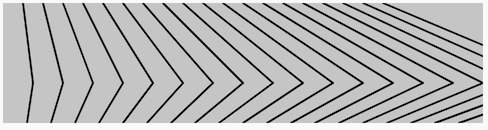
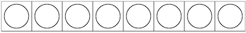
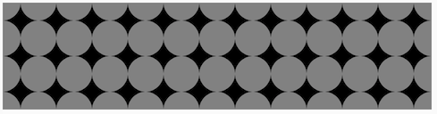
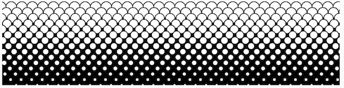

# Repetition: Loops

[](https://editor.p5js.org/jht1493/sketches/o_7ocEFZ8)

<!-- 
> Arrays intro here.  
> Object literal  
> Toolbox  
> Explore patterns with func 


-->

<!-- Repeated from objects -->
<!-- ## Arrays
* [video - 7.1 What is an array?](https://thecodingtrain.com/beginners/p5js/7.1-what-is-an-array.html) (~14 min)  
    - [sketch - click for next word](https://editor.p5js.org/codingtrain/sketches/DmwVbhOZ)
* [video - 7.2 Arrays and loops](https://thecodingtrain.com/beginners/p5js/7.2-arrays-loops.html) (~9 min)  
  - [sketch - circles from array](https://editor.p5js.org/codingtrain/sketches/ZnPevren)
-->
<!-- !!@ Update to use let -->


<!-- 
https://docs.google.com/document/d/117Uk1eSS9yzf-H35RXndyp2o3l9c-w95cs7Cum79QN0/edit
JHT Week 4 Worksheet
 -->

<!-- ## Getting Started with p5.js book
*  Chapter 4.5-4.13 of [Getting Started with p5.js book](http://amzn.to/2ckixCW) | [Ebook (free with NYU Library login)](https://ebookcentral.proquest.com/lib/nyulibrary-ebooks/detail.action?docID=4333728) | [Code](https://github.com/lmccart/gswp5.js-code) -->
## book - Getting Started with p5.js 
* [Getting Started with p5.js book](http://amzn.to/2ckixCW) 
  * [Ebook (free with NYU Library login)](https://ebookcentral.proquest.com/lib/nyulibrary-ebooks/detail.action?docID=4333728) 
  * [git source code](https://github.com/lmccart/gswp5.js-code)
*  Chapter 4 Variables 4.5-4.13
    * [sketches](https://editor.p5js.org/jht1493/collections/yH3IYcxzz)
<!-- -  Chapter 11 Arrays
    - [sketches](https://editor.p5js.org/jht1493/collections/GdOUniOjF) -->

## book - Code as Creative Medium 
  * Part One: Iterative Pattern
    * [Code as Creative Medium](https://www.amazon.com/gp/product/0262542048)

## tutorials: while-loops and for-loops
* [video 4.1: `while` and `for`](https://thecodingtrain.com/beginners/p5js/4.1-while-for.html
) (~14 min)
  * [sketch - while for ](https://editor.p5js.org/codingtrain/sketches/1B6jhzI6)
* [video 4.2: nested loops](https://thecodingtrain.com/beginners/p5js/4.2-nested-loops.html) (~10 min)
  * [sketch - nested loops](https://editor.p5js.org/codingtrain/sketches/nxJTfiJd)

<!-- ## tutorials: Arrays
* [video - 7.1 What is an array?](https://thecodingtrain.com/beginners/p5js/7.1-what-is-an-array.html) (~14 min)  
    - [sketch - click for next word](https://editor.p5js.org/codingtrain/sketches/DmwVbhOZ)
* [video - 7.2 Arrays and loops](https://thecodingtrain.com/beginners/p5js/7.2-arrays-loops.html) (~9 min)  
  - [sketch - circles from array](https://editor.p5js.org/codingtrain/sketches/ZnPevren)
 -->
<!-- * [4.1: `while` and `for` - video tutorial](https://www.youtube.com/watch?v=cnRD9o6odjk&list=PLRqwX-V7Uu6Zy51Q-x9tMWIv9cueOFTFA&index=14) -->
<!-- * [4.2: nested loops - video tutorial](https://www.youtube.com/watch?v=1c1_TMdf8b8&list=PLRqwX-V7Uu6Zy51Q-x9tMWIv9cueOFTFA&index=15) -->

## 10PRINT
* [book - 10 PRINT CHR$(205.5+RND(1)); : GOTO 10](https://10print.org)
* [10PRINT Coding Challenge video](https://youtu.be/bEyTZ5ZZxZs)
  * [sketch - 10PRINT code example](https://editor.p5js.org/icm/sketches/rkHKL962)
<!-- 
>> !!@ Does NOT use for loop 
>> convert to while-loop version 
!!@ Move to 02_animation or 03_interaction
-->

* Tutorial: [Recode Metaesquema by Hélio Oiticica](https://github.com/itpresidents/icm-help-sessions-2020/blob/master/session-04/session-04-example.md)

[](https://editor.p5js.org/jht1493/sketches/o_7ocEFZ8)

-------------------------------------------------------------------------------
# 4. Recap, Explore and Experiment - Repetition: Loops

## Ex 4.1 patterns with while-loops

In this exercise we'll explore creating patterns as seen in textiles or wall papers. We will also apply randomness to get variety. You can think of patterns as frozen imprints of the animations techniques we have used so far.

To repeatedly execute statements we can use the `while` conditional:

```
  while (**test**) {
    **statements**
  }
```
Any number of **statements** will be executed while the **test** is `true`. We must make sure the **test** is `false` at some point otherwise the browser will lockup and we will have to close the page.

Drawing a shape across the canvas can be done concisely using a variable and the `while` statement. In this sketch one row of a simple shape is drawn left to right on the canvas:

[](https://editor.p5js.org/jht1493/sketches/QlAHBLxi8e)

[sketch - 4.1 pattern while](https://editor.p5js.org/jht1493/sketches/QlAHBLxi8e)

```
  while (x < width) {
    console.log('x='+x+' y='+y);
    rect(x, y, 50, 50);
    circle(x + 25, y + 25, 40);
    x = x + 50;
  }
```

Compare this sketch to the previous sketches that produce animations. You'll should note that there is no `draw` function in this sketch. All drawing is done in the `setup` function.

### > Try

- modify the sketch to fill the canvas with the shape.
  - hint: add code to modify the `y` variable and test it against the canvas `height` variable

[sketch - 4.1 pattern y](https://editor.p5js.org/jht1493/sketches/S9YsVD9gV)

### > Try

- modify the previous sketch to consolidate the drawing code into a user defined function

[sketch - 4.1 pattern drawShape1](https://editor.p5js.org/jht1493/sketches/cA_XRhYnI)

### > Try

- modify the previous sketch to use randomness and your user defined function to create a variety of patterns

[sketch - 4.1 pattern random 1](https://editor.p5js.org/jht1493/sketches/JM1F5XmJuJ)

[sketch - 4.1 pattern random 2](https://editor.p5js.org/jht1493/sketches/44dcLkWoC)

[sketch - 4.1 pattern random 3](https://editor.p5js.org/jht1493/sketches/vqy_zDixd)

[sketch - 4.1 pattern random 4](https://editor.p5js.org/jht1493/sketches/_TkkjoNrW)

## Ex 4.2 for-loops

We can also repeatedly execute statements using the `for` statement. The essential expressions that affect the loop are grouped together.

```
  for (**initialize**; **test**; **change**) {
    **statements**
  }
```

The **initialize** code is executed once. While the **test** is `true` the **statements** are executed, followed by the **change** code.  

For example:

```
  for (let x = 0; x < 5; x += 1) {
    console.log('x='+x);
  }
```

The variable `x` will take on values 0, 1, 2, 3, 4.

### > Try

Write your own for-loop that draws a repeating shape on one row of the canvas.

[sketch - 4.2 for-loop](https://editor.p5js.org/jht1493/sketches/xlkU2_AlE)

### > Try

Fill the canvas with a  pattern. Organize your shape into a user defined function and have it fill the canvas using for-loops.

[sketch - 4.2 for-loop drawShape1](https://editor.p5js.org/jht1493/sketches/ZRMgh5oWA)


### > Try

Add randomness to your pattern.

[sketch - 4.2 for-loop random](https://editor.p5js.org/jht1493/sketches/cV8HNKv_D)

[sketch - 4.2 for-loop random 2](https://editor.p5js.org/jht1493/sketches/Bz-e4Japh)

[sketch - 4.2 for-loop random 3](https://editor.p5js.org/jht1493/sketches/YJojuZV9V)

[sketch - 4.2 for-loop random 4](https://editor.p5js.org/jht1493/sketches/uWqMpSb09)

<!-- ## Ex 4.3 arrays

### > array basics

Arrays are used to store multiple elements. These elements can be numbers, strings,objects, or other arrays. You can visualize an array as a building with multiple floors, each floor (element) holds a distinct value. The number of the floor is called it's index, with zero been the first floor. A variable can hold a single value, or refer to an array to hold many values.

One way to represent an array is as an array literal. An array literal begins with an open square bracket and has any number of elements, separated by commas, and ends with a closing square bracket.
```
// Syntax: assign an array to variable
let array_ref = [ **element0**, **element1**, **element2** ... ];

// Examples:
let a1 = [10,'blue']; // Array with 2 elements
let a1 = ['red']; // Array with 1 element
let a2 = []; // Array with zero elements
```
To access an element in an array use an index enclosed in square brackets. The first element is at numerical index 0, second at 1, etc... The number of elements held by the array is available with the array length property. The index of the last element in an array is its length minus 1 (since first index of the array is zero).
```
// Syntax: extract an element from an array
let value = array_ref[ **index** ];

// Examples:
let first = array_ref[0]; // Get the first element
let second = array_ref[1]; // Get the second element
let last = array_ref[array_ref.length-1]; // Get the last element
```

[sketch - 4.3 array d](https://editor.p5js.org/jht1493/sketches/PkHBdgZak)

Example: Array holding numbers used for the size of a line of circles.
Each click gets the next size.

[sketch - 4.3 array colors](https://editor.p5js.org/jht1493/sketches/MN_30o-l-)

Example: Array used to hold color name strings. Each click uses the next color from the array.

[sketch - 4.3 array colors alpha](https://editor.p5js.org/jht1493/sketches/a81qFOT7_)

Example: Array used to hold color array of red, green, blue, alpha. Each click uses the next color from the array.

[sketch - 4.3 array for-loop](https://editor.p5js.org/jht1493/sketches/Gom4JIsDb)

Example: Six circles of different sizes using an array and a for-loop.

[sketch - 4.3 array for-loop 2](https://editor.p5js.org/jht1493/sketches/tNqn2o0M3)

Example: Drawing circles of different sizes and colors using arrays and for-loop. 

### > Try

Re-mix a sketch or create a new sketch that makes use of an array to produce a pattern that fills the canvas. 

[sketch - 4.3 array for-loop 3](https://editor.p5js.org/jht1493/sketches/NZSWjB70Y)

Example: Circles repeated to fill the canvas.

[sketch - 4.3 array for-loop 4](https://editor.p5js.org/jht1493/sketches/d1C72NC0Q)

Example: Circles repeated to fill the canvas, variation.

### > adding elements to an array

The array push function is used to add an element to the end of the array.

```
// Syntax: add in an element to an array
array_ref.push( **new_element** );

// Examples:
let a1 = [];
a1.push(10);
a1.push('green');
// a1 is now [10, 'green']
```

[sketch - 4.3 array add](https://editor.p5js.org/jht1493/sketches/wl7Kc2bCW)

Example: an array filled with random values 10 or 40 and used to draw a pattern of circles.

```
let a_d = [];
// Fill the array with random numbers 10 or 40
for (let i = 0; i < 10; i++) {
  a_d.push(random([10, 40]));
}
``` -->
<!--
This is better dealt with as objects
### > Try

Array can be used to create multiple versions of a shape. Create your own or re-mix using these examples.

[sketch - bouncing ball xy](https://editor.p5js.org/icm/sketches/BJKWv5Tn)

Re-mix bouncing ball example from previous session to use arrays to create multiple bouncing balls.

[sketch - 4.3 array bouncing balls](https://editor.p5js.org/jht1493/sketches/ss-mUo0A2)

[sketch - 4.3 array bouncing balls 2](https://editor.p5js.org/jht1493/sketches/CYdufPe8D)

[sketch - 4.3 array bouncing balls 3](https://editor.p5js.org/jht1493/sketches/gVFoxRUsw)

<!-- 

>> array of points, draw and jiggle with randomness
 -->
<!-- 
### > removing values from an array

Use the array `splice` function to remove elements from an array.

```
// Syntax: to remove elements from an array
array_ref.splice( **start_index**, **delete_count** );

// Examples:
let a1 = [10, 'green'];
a1.splice(1,1); // Remove the second element
// a1 is now [10]
``` -->
<!--
Consider adding example to try removing elements from an array
### > Try

Add a button to remove a ball from a `bouncing balls` example.

[sketch - 4.3 array bouncing balls remove](https://editor.p5js.org/jht1493/sketches/7l92OzPjl)

-->

<!-- 
>> splice(start, deleteCount)

https://developer.mozilla.org/en-US/docs/Web/JavaScript/Reference/Global_Objects/Array/splice

splice(start)
splice(start, deleteCount)
splice(start, deleteCount, item1)
splice(start, deleteCount, item1, item2, itemN)

 -->


<!-- 

p5js array shuffle

https://initjs.org/all-permutations-of-a-set-f1be174c79f8

https://developer.mozilla.org/en-US/docs/Web/JavaScript/Reference/Global_Objects/Array/sort


sort()
sort(function (firstEl, secondEl) { ... })

 -->

-------------------------------------------------------------------------------
## Getting Started with p5.js book sketches

Sketches from the [Getting Started book](http://amzn.to/2ckixCW).  
You are invited to remix and combine them to further explore.
 
- Chapter 4 Variables

[Ex_04_05 Do the Same](https://editor.p5js.org/jht1493/sketches/nUqcuwlY9)  
[Ex_04_06 Use a for Loop](https://editor.p5js.org/jht1493/sketches/h0eBcXsIC)  
[Ex_04_07 Flex Your for Loop’s](https://editor.p5js.org/jht1493/sketches/oVh1WhBVI)  
[Ex_04_08 Fanning Out the Lines](https://editor.p5js.org/jht1493/sketches/Zxxj1cjH9)  
[Ex_04_09 Kinking the Lines](https://editor.p5js.org/jht1493/sketches/o_7ocEFZ8)  
[Ex_04_10 Embed for Loop](https://editor.p5js.org/jht1493/sketches/bFe6Hk45R)  
[Ex_04_11 Rows and Columns](https://editor.p5js.org/jht1493/sketches/SemvF_Fht)  
[Ex_04_12 Pins and Lines](https://editor.p5js.org/jht1493/sketches/u15OM3OHP)  
[Ex_04_13 Halftone Dots](https://editor.p5js.org/jht1493/sketches/GO50HlzHN)  
[Ex_04_99 Robot 2: Variables](https://editor.p5js.org/jht1493/sketches/mJ_X4q47O)  
[Ex_04_99 Robot 2: Variable func](https://editor.p5js.org/jht1493/sketches/cyyCJGXOz)  
[Ex_04_99 Robot 2: func jiggle](https://editor.p5js.org/jht1493/sketches/D3QUVpQhx)  

<!-- - Chapter 11 Arrays

[Ex_11_01 Many Variables](https://editor.p5js.org/jht1493/sketches/W26Y1uuiu)  
[Ex_11_02 Too Many Variables](https://editor.p5js.org/jht1493/sketches/WNdXMzR_Q)  
[Ex_11_03 Arrays, Not Variables](https://editor.p5js.org/jht1493/sketches/mJyTluseZ)  
[Ex_11_04 Declare and Assign an Array](https://editor.p5js.org/jht1493/sketches/FghpP9uDR)  
[Ex_11_05 Assigning to an Array in One Go](https://editor.p5js.org/jht1493/sketches/n3apYawMJ)  
[Ex_11_06 Revisiting the First Example](https://editor.p5js.org/jht1493/sketches/WSHfHkoyV)  
[Ex_11_07 Filling an Array in a for Loop](https://editor.p5js.org/jht1493/sketches/BjH5BkIjj)  
[Ex_11_08 Track Mouse Movements](https://editor.p5js.org/jht1493/sketches/pVd3PT6U3)  
[Ex_11_09 Managing Many Objects](https://editor.p5js.org/jht1493/sketches/XDfmnW1JD)  
[Ex_11_10 Sequences of Images](https://editor.p5js.org/jht1493/sketches/-XbD5Gw0a)  
[Ex_11_99 Robot Array](https://editor.p5js.org/jht1493/sketches/dO-IXUHhr)

[](https://editor.p5js.org/jht1493/sketches/bFe6Hk45R)
[](https://editor.p5js.org/jht1493/sketches/kEyYmVtg-) -->

