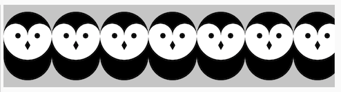
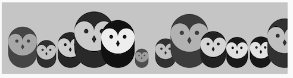

# Organization: Functions

[](https://editor.p5js.org/jht1493/sketches/AVYN7MUVc)

<!-- 
https://docs.google.com/document/d/1-3Ti4n0kBs7TeI5E9ZDPDwqP7IZqMn2ckHZxaS9ihYg/edit
JHT Week 5 Worksheet
 -->

<!-- 
_The videos in this section were created ~2 years ago. They use different editors for p5.js. All of the concepts should still apply, however, there are some minor changes. Most notably in JavaScript `let` is now the preferred way to declare a variable over `var`. If you would like to learn more about this you can [watch this video about let vs var](https://youtu.be/q8SHaDQdul0)._ 
-->

<!-- 
>> !!@ object literals use for modularity/encapsulation
functions modularize behavior
object literals modularize state/data

>> recursion as loop


function MakeEntity(it) {
  it.action = function (it) {
    //....
  };
  return it;
}
let ent1 = MakeEntity({});
ent1.action(ent1);
let ent2 = MakeEntity({x: 0});
OR: 
action(ent1)

>> add to week 6 & week 7
> draw function as looping in time
> recursion as a form of looping

 -->

## book - Getting Started with p5.js 
* [Getting Started with p5.js book](http://amzn.to/2ckixCW) 
    * [Ebook (free with NYU Library login)](https://ebookcentral.proquest.com/lib/nyulibrary-ebooks/detail.action?docID=4333728) 
    * [git source code](https://github.com/lmccart/gswp5.js-code)
*  Chapter 9 Functions
    * [sketches](https://editor.p5js.org/jht1493/collections/RNo3VMponN)

## tutorials: Modularity

- [video 5.1: Function Basics](https://thecodingtrain.com/beginners/p5js/5.1-function-basics.html) (~13 min)
  - [sketch - Function Basics ball](https://editor.p5js.org/codingtrain/sketches/omHOuJY1) 
  - [sketch - Bouncing ball with functions](https://editor.p5js.org/icm/sketches/H1Oq4qta)

<!-- 
>> !!@  uses object literals 
>> !!@  expand with multiple balls
array add
array remove
-->

## tutorials: Re-usability

- [video 5.2: Function Parameters and Arguments](https://thecodingtrain.com/beginners/p5js/5.2-parameters-arguments.html) (~11 min)
  - [sketch - lollipop](https://editor.p5js.org/codingtrain/sketches/eGD-xzsw)
  - [sketch - Dice no functions](https://editor.p5js.org/icm/sketches/ryx70m5tT)
  - [sketch - Dice w/ functions](https://editor.p5js.org/icm/sketches/S1R44qtT)
  - [sketch - Robots from Getting Started with p5.js Code Example](https://editor.p5js.org/icm/sketches/rylf4S5K6)
<!-- >> !!@ expand with object literals -->

- [video 5.3: Functions and Return](https://thecodingtrain.com/beginners/p5js/5.3-return.html) (~8 min)
  - [sketch - milesToKm](https://editor.p5js.org/codingtrain/sketches/twpIiI-v)
  - [sketch - Implementing distance function](https://editor.p5js.org/icm/sketches/HJgR7UcKa)

<!-- - [5.1: Function Basics - video tutorial](https://www.youtube.com/watch?v=wRHAitGzBrg&list=PLRqwX-V7Uu6Zy51Q-x9tMWIv9cueOFTFA&index=16)
- [5.2: Function Parameters and Arguments - video tutorial](https://www.youtube.com/watch?v=zkc417YapfE&list=PLRqwX-V7Uu6Zy51Q-x9tMWIv9cueOFTFA&index=17)
- [5.3: Functions and Return - video tutorial](https://www.youtube.com/watch?v=qRnUBiTJ66Y&list=PLRqwX-V7Uu6Zy51Q-x9tMWIv9cueOFTFA&index=18) -->

<!-- ## Getting Started with p5.js book
- Chapter 9 of [Getting Started with p5.js book](http://amzn.to/2ckixCW) | [Ebook (free with NYU Library login)](https://ebookcentral.proquest.com/lib/nyulibrary-ebooks/detail.action?docID=4333728) | [Code](https://github.com/lmccart/gswp5.js-code) -->

## tutorials: Object Literals

- [Video Object Literals](https://www.youtube.com/watch?v=-e5h4IGKZRY) 
  - [sketch - JavaScript Objects](https://editor.p5js.org/codingtrain/sketches/6J5VPMbW)

## Going Further

- [Coding Challenge video: Recursion](https://youtu.be/jPsZwrV9ld0)
  - [sketch - recursion code example](https://editor.p5js.org/icm/sketches/Hyevi8ct6)
- [Coding Challenge video: Fractal Tree](https://youtu.be/0jjeOYMjmDU) - note this video uses the p5.dom function `createSlider()` which we have yet to cover in class!
  - [sketch - fractal tree code example](https://editor.p5js.org/icm/sketches/rkZAJ6PtX)
  - Tutorial: [Recode Morisawa series by John Maeda](https://github.com/itpresidents/icm-help-sessions-2020/blob/master/session-05/session-05-example.md)

[](https://editor.p5js.org/jht1493/sketches/AVYN7MUVc)

-------------------------------------------------------------------------------
# 5. Recap, Explore and Experiment - Functions

## Ex 5.1 bouncing ball

Functions are a versatile tool for organizing your code and building more complex sketches. Let's explore using an example sketch from the video tutorial.

[sketch - Ex 5.1 bouncing ball](https://editor.p5js.org/jht1493/sketches/MDR4y_0ey)
<!-- [sketch - bouncing ball xy](https://editor.p5js.org/icm/sketches/BJKWv5Tn) -->

Sketch of a ball bounding within the edges of the canvas.

[sketch - Ex 5.1 bouncing ball function](https://editor.p5js.org/jht1493/sketches/rwosDvy8s)
<!-- [sketch - Function Basics ball](https://editor.p5js.org/codingtrain/sketches/omHOuJY1)  -->

Same behavior using a user defined function `draw_ball` and the object literal `ball`.

A few things to note about the second sketch:
- The intent of the code is hinted at by the function name `draw_ball`.
- The intent of the variables is hinted at by the variable name of the object literal, `ball`.

As we go from simple sketches to more complex ones functions and object literals can help us by making our intention for the code more explicit.

Study the code and note the differences.

### > bouncing ball code
```
let x = 160;
let y = 90;
let xspeed = 5;
let yspeed = 2;
let r = 20;

function setup() {
  createCanvas(320, 180);
}

function draw() {
  background(0);
  ellipse(x, y, r * 2, r * 2);
  x += xspeed;
  y += yspeed;
  if (x > width - r || x < r) {
    xspeed = -xspeed;
  }
  if (y > height - r || y < r) {
    yspeed = -yspeed;
  }
}
```

### > bouncing ball function code
```
let ball = {
  x: 160,
  y: 90,
  xspeed: 5,
  yspeed: 2,
  r: 20,
};

function setup() {
  createCanvas(320, 180);
}

function draw() {
  background(0);
  draw_ball();
}

function draw_ball() {
  ellipse(ball.x, ball.y, ball.r * 2, ball.r * 2);
  ball.x += ball.xspeed;
  ball.y += ball.yspeed;
  if (ball.x > width - ball.r || ball.x < ball.r) {
    ball.xspeed = -ball.xspeed;
  }
  if (ball.y > height - ball.r || ball.y < ball.r) {
    ball.yspeed = -ball.yspeed;
  }
}
```

### > Object Literals and naming

The object literal begins at the top of the sketch with the code `let ball = { ...`. All the variables related to the ball are grouped inside the object literal which begins with the curly bracket. The variables inside the object literal are later refered to using the dot syntax: `ball.x`. eg. `ellipse(ball.x, ...`

It's a good practice to use object literal for related global variables to avoid naming conflicts with p5js. For example a global variable named `scale` or `image` can unintentionally conflict with the p5js global of the same name.

Also recommended is to use underscore in your global function names, eg. `draw_ball`, to avoid p5js naming conflict.

### > Try

- add a color variable to the sketch

[sketch - Ex 5.1 bouncing color](https://editor.p5js.org/jht1493/sketches/4XHAe1BM5)

- create a button to adjust the speed of the ball

[sketch - Ex 5.1 bouncing speed](https://editor.p5js.org/jht1493/sketches/HsQDi5mPF)

## Ex 5.2 parameter variables

What if we wanted to have two balls bouncing? 

We could duplicate the `ball` variable and add variable `ball2`. 

What about the `draw_ball` function? It is tied to the `ball` variable. Do we need to create a `draw_ball2` function for `ball2`? 

Not necessarily, we could generalize the function `draw_ball` to work with any ball using a parameter variable. Here is the sketch re-mixed for two balls:

[sketch - Ex 5.2 bouncing two](https://editor.p5js.org/jht1493/sketches/CrWz1PalX)

```
let ball = {
  x: 160,
  y: 90,
  xspeed: 5,
  yspeed: 2,
  r: 20,
  c: 'red'
};

let ball2 = {
  x: 80,
  y: 90,
  xspeed: 2,
  yspeed: 5,
  r: 20,
  c: 'green'
};

function setup() {
  createCanvas(320, 180);
}

function draw() {
  background(0);
  draw_ball(ball);
  draw_ball(ball2);
}

function draw_ball(b) {
  fill(b.c);
  ellipse(b.x, b.y, b.r * 2, b.r * 2);
  b.x += b.xspeed;
  b.y += b.yspeed;
  if (b.x > width - b.r || b.x < b.r) {
    b.xspeed = -b.xspeed;
  }
  if (b.y > height - b.r || b.y < b.r) {
    b.yspeed = -b.yspeed;
  }
}
```
<!-- 
## Ex 5.3 object literals in arrays

We use arrays whenever we want any number of things. Not only can arrays store simple values like numbers and strings, they can also store object literals.

Building on what was presented in the previous session on arrays, here is the sketch re-mixed for any number of balls.

[sketch - Ex 5.2 bouncing array](https://editor.p5js.org/jht1493/sketches/W9-irZBQj)

```
let a_balls = [];

function setup() {
  createCanvas(320, 180);
  createButton("Add ball").mousePressed(function () {
    add_ball();
  });
}

function draw() {
  background(0);
  for (i = 0; i < a_balls.length; i++) {
    draw_ball(a_balls[i]);
  }
}

function draw_ball(b) {
  fill(b.c);
  ellipse(b.x, b.y, b.r * 2, b.r * 2);
  b.x += b.xspeed;
  b.y += b.yspeed;
  if (b.x > width - b.r || b.x < b.r) {
    b.xspeed = -b.xspeed;
  }
  if (b.y > height - b.r || b.y < b.r) {
    b.yspeed = -b.yspeed;
  }
}

function add_ball() {
  let b = {
    x: random(width),
    y: random(height),
    xspeed: random([0, 4]),
    yspeed: random([0, 4]),
    r: random([5, 10, 20]),
    c: random(["red", "green", "yellow"]),
  };
  a_balls.push(b);
}
```

### > Try

- add button to remove a ball
- add buttons to make the balls less random in speed, color, size.
- convert from animation to pattern making
 -->
<!-- 

https://editor.p5js.org/codingtrain/sketches/omHOuJY1
- [sketch - Function Basics ball]

>> drawing with array of points

>> do more with return.

>> return random color, loc, obj literal 

>> object literals -- passing an returning

>> arrays with object literals

>> array of createGraphics layers.
https://p5js.org/reference/#/p5/createGraphics
createGraphics(w, h, [renderer])
p5.Graphics: offscreen graphics buffer

>> pseudo code

>> playing computer

>> slider ui + read out ui

>> text input ui

-->


-------------------------------------------------------------------------------
## Getting Started with p5.js book sketches

Sketches from the [Getting Started book](http://amzn.to/2ckixCW)   
You are invited to remix and combine them to further explore.

- Chapter 9 Functions

[Ex_09_01 Roll the Dice](https://editor.p5js.org/jht1493/sketches/uetaqd2FH)  
[Ex_09_02 Another Way](https://editor.p5js.org/jht1493/sketches/oK-w6sUbz)  
[Ex_09_03 Draw the Owl](https://editor.p5js.org/jht1493/sketches/DdDo_LBJa)  
[Ex_09_04 Two’s Company](https://editor.p5js.org/jht1493/sketches/sa96pUoKH)  
[Ex_09_05 An Owl Function](https://editor.p5js.org/jht1493/sketches/NAl5YSdTI_)  
[Ex_09_06 Increasing the Surplus Population](https://editor.p5js.org/jht1493/sketches/AVYN7MUVc)  
[Ex_09_07 Owls of Different Sizes](https://editor.p5js.org/jht1493/sketches/45Cv8Gi4i)  
[Ex_09_08 Return a Value](https://editor.p5js.org/jht1493/sketches/xAc-jbG9y)  
[Ex_09_99 Robot Function](https://editor.p5js.org/jht1493/sketches/7QXYp9M8Z)

[](https://editor.p5js.org/jht1493/sketches/45Cv8Gi4i)

